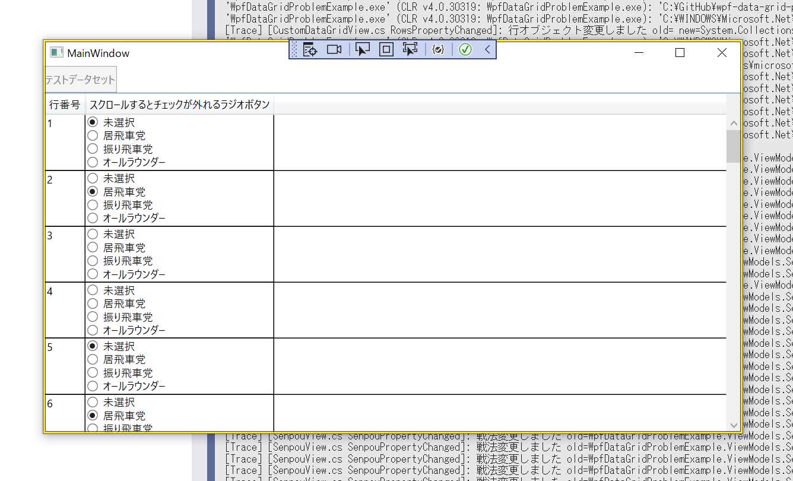

# wpf-data-grid-problem-example

WPFのDataGrid の難しいところのサンプル（＾～＾）

## 問題１

  

👆　スクロールするとチェックが外れるラジオボタン  

📖 [C# WPF Datagrid with recycling virtualization](https://stackoverflow.com/questions/35861976/c-sharp-wpf-datagrid-with-recycling-virtualization)  

📖 [DataGridの基本的な事](http://tawamuredays.blog.fc2.com/blog-entry-71.html)  
👆 この記事によると、DataGrid要素に……  

↓これは必須らしい  

```xaml
VirtualizingStackPanel.IsVirtualizing="True"
```

↓これが Recycleだと表示が乱れるらしい。Standardにすると直るが、メモリや速度に優しくないらしい  

```xaml
VirtualizingStackPanel.VirtualizationMode="Standard"
```

## TODO 問題２

背景色を変更できないコンボボックス  

## TODO 問題３

存在しないスピンボックス  

## TODO 問題４

背景色を設定できず、`▼`と表示するとクリックできる面積が１文字分しかないリピートボタン  

## TODO 問題５

変更できないスクロールバーのスライダーボックス（Thumb）の色  

## TODO 問題６

ボタンのテキストの横に画像を置き、disable時にテキストと画像を共にグレーアウトする方法  
